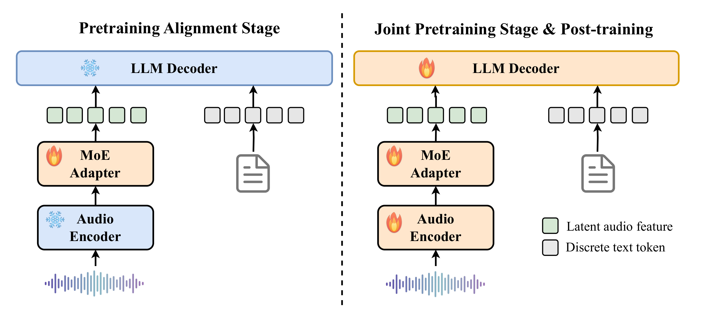
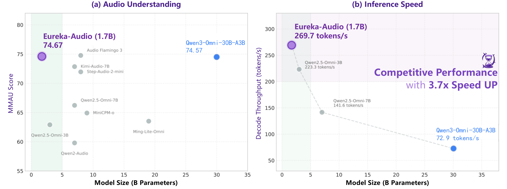

<p align="center">
    
<p>

<p align="center">
  <b>Eureka-Audio-Instruct</b>
</p>

<p align="center">
  <a href="https://huggingface.co/cslys1999/Eureka-Audio-Instruct">
    
  </a>
  &nbsp;
  <a href="https://www.modelscope.cn/models/lys1999/Eureka-Audio-Instruct">
    
  </a>
  &nbsp;
  <a href="https://arxiv.org/abs/2602.13954">
    
  </a>
</p>

We present **Eureka-Audio**, a compact yet high-performance audio language model that achieves competitive performance against models that are **4 to 18 times larger** across a broad range of audio understanding benchmarks. Despite containing only **1.7B parameters**, Eureka-Audio demonstrates strong performance on automatic speech recognition (ASR), audio understanding, and dense audio captioning, matching or surpassing multiple 7B to 30B audio and omni-modal baselines.


## News

* Feb 25, 2026: We release the inference code and model weights of [Eureka-Audio-Instruct](https://huggingface.co/cslys1999/Eureka-Audio-Instruct).
* Feb 17, 2026: We release the technical report of [Eureka-Audio](https://arxiv.org/abs/2602.13954).


## Table of Contents

- [Introduction](#introduction)
- [Architecture Overview](#architecture-overview)
- [Quick Start](#quick-start)
- [Evaluation](#evaluation)
  - [Automatic Speech Recognition](#automatic-speech-recognition-asr)
  - [Audio Understanding](#audio-understanding)
  - [Dense Audio Captioning](#dense-audio-captioning)
- [License](#license)
- [Acknowledgements](#acknowledgements)
- [Citation](#citation)


## Introduction

Eureka-Audio is designed as a lightweight yet powerful audio foundation model capable of handling a wide variety of audio understanding tasks within a single unified framework. Key features include:

* **Lightweight yet Powerful:** Achieve competitive results with only **1.7B parameters**, delivering up to **3.7x faster** decoding speed compared to larger models.
* **Universal Audio Understanding:** Handle diverse tasks like automatic speech recognition (ASR), audio question answering, audio captioning, speech emotion recognition, and sound event classification.
* **Competitive Performance:** Achieve competitive performance against models that are 4 to 18 times larger, matching or surpassing multiple 7B-30B audio and omni-modal baselines.
* **DataFlux Pipeline:** A closed-loop audio instruction data synthesis and verification pipeline that constructs high-quality, logically consistent supervision from raw audio.
* **Sparse MoE Adapter:** A novel sparsely activated Mixture-of-Experts adapter that explicitly accounts for audio heterogeneity and alleviates cross-modal optimization conflicts.
* **Open-Source:** Release the code and model checkpoints for community research and development.


## Architecture Overview

<p align="center">
    
<p>

Eureka-Audio consists of three main components:

1. **Audio Encoder:** A Whisper-based audio encoder that encodes raw waveforms into high-temporal-resolution acoustic representations, capturing fine-grained perceptual and semantic information present in the audio signal.

2. **Sparse MoE Adapter:** A Mixture-of-Experts adapter that maps audio representations into the embedding space of the language model. This design explicitly models the heterogeneity of audio signals at both the semantic and acoustic levels, mitigating optimization conflicts while improving representational efficiency.

3. **Language Model Backbone:** Qwen3-1.7B-base serves as the language backbone. After alignment via the MoE Adapter, audio embeddings are concatenated with text token embeddings and jointly modeled by the backbone in a standard autoregressive manner.


## Getting Started

### Installation

```bash
git clone https://github.com/Alittleegg/Eureka-Audio.git
cd Eureka-Audio
pip install -r requirements.txt
```

### Using HuggingFace Transformers

```python
from transformers import AutoModelForCausalLM, AutoTokenizer
import torch

# Load model with trust_remote_code
model = AutoModelForCausalLM.from_pretrained(
    "cslys1999/Eureka-Audio-Instruct",
    torch_dtype=torch.bfloat16,
    device_map="auto",
    trust_remote_code=True,
)
```

## Quick Start

This example demonstrates basic usage for generating text from audio.

```
# ASR
python infer.py --model_path ${your_model_path} --audio_path ${your_audio_path} --task asr

# QA
python infer.py --model_path ${your_model_path} --audio_path ${your_audio_path} --task qa --question "Descript the audio."

# Caption
python infer.py --model_path ${your_model_path} --audio_path ${your_audio_path} --task caption
```

## Evaluation

Eureka-Audio achieves competitive performance across a wide range of audio benchmarks despite having only 1.7B parameters.

<p align="center">
    
<p>


### Automatic Speech Recognition (ASR)

<table>
  <thead>
    <tr>
      <th>Datasets</th>
      <th>Type</th>
      <th>Model</th>
      <th>Size</th>
      <th>WER/CER ↓</th>
    </tr>
  </thead>
  <tbody>
    <tr>
      <td rowspan="11"><strong>LibriSpeech</strong><br>test-clean | test-other</td>
      <td rowspan="5"><em>Omni</em></td>
      <td>Qwen3-Omni-Instruct</td>
      <td>30B-A3B</td>
      <td>1.60 | 2.93</td>
    </tr>
    <tr>
      <td>Ming-Lite-Omni-1.5</td>
      <td>19B-A2.8B</td>
      <td>1.90 | 3.54</td>
    </tr>
    <tr>
      <td>MiniCPM-o</td>
      <td>9B</td>
      <td>2.01 | 4.87</td>
    </tr>
    <tr>
      <td>Qwen2.5-Omni-7B</td>
      <td>7B</td>
      <td>1.53 | 3.19</td>
    </tr>
    <tr>
      <td>Qwen2.5-Omni-3B</td>
      <td>3B</td>
      <td>1.68 | 3.90</td>
    </tr>
    <tr>
      <td rowspan="4"><em>Audio</em></td>
      <td>Step-Audio-2-mini</td>
      <td>8B</td>
      <td>1.41 | 2.76</td>
    </tr>
    <tr>
      <td>Audio Flamingo 3</td>
      <td>8B</td>
      <td>1.39 | 2.96</td>
    </tr>
    <tr>
      <td>Qwen2-Audio</td>
      <td>7B</td>
      <td>1.74 | 4.01</td>
    </tr>
    <tr>
      <td>Kimi-Audio-7B-Instruct</td>
      <td>7B</td>
      <td>1.33 | 2.57</td>
    </tr>
    <tr>
      <td rowspan="2"><em>Ours</em></td>
      <td>Eureka-Audio-Base</td>
      <td>1.7B</td>
      <td>1.59 | 3.34</td>
    </tr>
    <tr>
      <td><strong>Eureka-Audio-Instruct</strong></td>
      <td><strong>1.7B</strong></td>
      <td><strong>1.46 | 3.24</strong></td>
    </tr>
    <tr>
      <td rowspan="11"><strong>Fleurs-en</strong></td>
      <td rowspan="5"><em>Omni</em></td>
      <td>Qwen3-Omni-Instruct</td>
      <td>30B-A3B</td>
      <td>5.04</td>
    </tr>
    <tr>
      <td>Ming-Lite-Omni-1.5</td>
      <td>19B-A2.8B</td>
      <td>5.82</td>
    </tr>
    <tr>
      <td>MiniCPM-o</td>
      <td>9B</td>
      <td>6.18</td>
    </tr>
    <tr>
      <td>Qwen2.5-Omni-7B</td>
      <td>7B</td>
      <td>5.49</td>
    </tr>
    <tr>
      <td>Qwen2.5-Omni-3B</td>
      <td>3B</td>
      <td>5.65</td>
    </tr>
    <tr>
      <td rowspan="4"><em>Audio</em></td>
      <td>Step-Audio-2-mini</td>
      <td>8B</td>
      <td>4.51</td>
    </tr>
    <tr>
      <td>Audio Flamingo 3</td>
      <td>8B</td>
      <td>6.30</td>
    </tr>
    <tr>
      <td>Qwen2-Audio</td>
      <td>7B</td>
      <td>6.92</td>
    </tr>
    <tr>
      <td>Kimi-Audio-7B-Instruct</td>
      <td>7B</td>
      <td>6.11</td>
    </tr>
    <tr>
      <td rowspan="2"><em>Ours</em></td>
      <td>Eureka-Audio-Base</td>
      <td>1.7B</td>
      <td>5.73</td>
    </tr>
    <tr>
      <td><strong>Eureka-Audio-Instruct</strong></td>
      <td><strong>1.7B</strong></td>
      <td><strong>5.39</strong></td>
    </tr>
    <tr>
      <td rowspan="10"><strong>AISHELL-2</strong> ios</td>
      <td rowspan="5"><em>Omni</em></td>
      <td>Qwen3-Omni-Instruct</td>
      <td>30B-A3B</td>
      <td>2.63</td>
    </tr>
    <tr>
      <td>Ming-Lite-Omni-1.5</td>
      <td>19B-A2.8B</td>
      <td>2.66</td>
    </tr>
    <tr>
      <td>MiniCPM-o</td>
      <td>9B</td>
      <td>3.42</td>
    </tr>
    <tr>
      <td>Qwen2.5-Omni-7B</td>
      <td>7B</td>
      <td>2.58</td>
    </tr>
    <tr>
      <td>Qwen2.5-Omni-3B</td>
      <td>3B</td>
      <td>2.77</td>
    </tr>
    <tr>
      <td rowspan="3"><em>Audio</em></td>
      <td>Step-Audio-2-mini</td>
      <td>8B</td>
      <td>2.33</td>
    </tr>
    <tr>
      <td>Qwen2-Audio</td>
      <td>7B</td>
      <td>3.08</td>
    </tr>
    <tr>
      <td>Kimi-Audio-7B-Instruct</td>
      <td>7B</td>
      <td>2.80</td>
    </tr>
    <tr>
      <td rowspan="2"><em>Ours</em></td>
      <td>Eureka-Audio-Base</td>
      <td>1.7B</td>
      <td>3.17</td>
    </tr>
    <tr>
      <td><strong>Eureka-Audio-Instruct</strong></td>
      <td><strong>1.7B</strong></td>
      <td><strong>3.10</strong></td>
    </tr>
    <tr>
      <td rowspan="10"><strong>WenetSpeech</strong><br>test-meeting | test-net</td>
      <td rowspan="5"><em>Omni</em></td>
      <td>Qwen3-Omni-Instruct</td>
      <td>30B-A3B</td>
      <td>6.12 | 5.29</td>
    </tr>
    <tr>
      <td>Ming-Lite-Omni-1.5</td>
      <td>19B-A2.8B</td>
      <td>5.96 | 6.26</td>
    </tr>
    <tr>
      <td>MiniCPM-o</td>
      <td>9B</td>
      <td>15.53 | 7.68</td>
    </tr>
    <tr>
      <td>Qwen2.5-Omni-7B</td>
      <td>7B</td>
      <td>8.43 | 7.10</td>
    </tr>
    <tr>
      <td>Qwen2.5-Omni-3B</td>
      <td>3B</td>
      <td>8.53 | 7.14</td>
    </tr>
    <tr>
      <td rowspan="3"><em>Audio</em></td>
      <td>Step-Audio-2-mini</td>
      <td>8B</td>
      <td>5.43 | 5.50</td>
    </tr>
    <tr>
      <td>Qwen2-Audio</td>
      <td>7B</td>
      <td>8.40 | 8.00</td>
    </tr>
    <tr>
      <td>Kimi-Audio-7B-Instruct</td>
      <td>7B</td>
      <td>6.38 | 7.17</td>
    </tr>
    <tr>
      <td rowspan="2"><em>Ours</em></td>
      <td>Eureka-Audio-Base</td>
      <td>1.7B</td>
      <td>10.37 | 8.63</td>
    </tr>
    <tr>
      <td><strong>Eureka-Audio-Instruct</strong></td>
      <td><strong>1.7B</strong></td>
      <td><strong>9.14 | 7.55</strong></td>
    </tr>
  </tbody>
</table>


### Audio Understanding

<table>
  <thead>
    <tr>
      <th>Datasets</th>
      <th>Type</th>
      <th>Model</th>
      <th>Size</th>
      <th>Performance ↑</th>
    </tr>
  </thead>
  <tbody>
    <tr>
      <td rowspan="11"><strong>Knowledge</strong><br>MMSU | OpenBookQA</td>
      <td rowspan="5"><em>Omni</em></td>
      <td>Qwen3-Omni-Instruct</td>
      <td>30B-A3B</td>
      <td>77.00 | 92.31</td>
    </tr>
    <tr>
      <td>Ming-Lite-Omni-1.5</td>
      <td>19B-A2.8B</td>
      <td>47.00 | 69.67</td>
    </tr>
    <tr>
      <td>MiniCPM-o</td>
      <td>9B</td>
      <td>54.55 | 79.12</td>
    </tr>
    <tr>
      <td>Qwen2.5-Omni-7B</td>
      <td>7B</td>
      <td>61.22 | 81.53</td>
    </tr>
    <tr>
      <td>Qwen2.5-Omni-3B</td>
      <td>3B</td>
      <td>53.41 | 77.36</td>
    </tr>
    <tr>
      <td rowspan="4"><em>Audio</em></td>
      <td>Step-Audio-2-mini</td>
      <td>8B</td>
      <td>55.14 | 75.60</td>
    </tr>
    <tr>
      <td>Audio Flamingo 3</td>
      <td>8B</td>
      <td>47.07 | 61.54</td>
    </tr>
    <tr>
      <td>Qwen2-Audio</td>
      <td>7B</td>
      <td>35.75 | 49.67</td>
    </tr>
    <tr>
      <td>Kimi-Audio-7B-Instruct</td>
      <td>7B</td>
      <td>61.26 | 84.18</td>
    </tr>
    <tr>
      <td rowspan="2"><em>Ours</em></td>
      <td>Eureka-Audio-Base</td>
      <td>1.7B</td>
      <td>38.03 | 52.53</td>
    </tr>
    <tr>
      <td><strong>Eureka-Audio-Instruct</strong></td>
      <td><strong>1.7B</strong></td>
      <td><strong>55.63 | 69.23</strong></td>
    </tr>
    <tr>
      <td rowspan="10"><strong>Safety</strong><br>AdvBench</td>
      <td rowspan="5"><em>Omni</em></td>
      <td>Qwen3-Omni-Instruct</td>
      <td>30B-A3B</td>
      <td>99.61</td>
    </tr>
    <tr>
      <td>Ming-Lite-Omni-1.5</td>
      <td>19B-A2.8B</td>
      <td>99.23</td>
    </tr>
    <tr>
      <td>MiniCPM-o</td>
      <td>9B</td>
      <td>95.76</td>
    </tr>
    <tr>
      <td>Qwen2.5-Omni-7B</td>
      <td>7B</td>
      <td>96.92</td>
    </tr>
    <tr>
      <td>Qwen2.5-Omni-3B</td>
      <td>3B</td>
      <td>89.80</td>
    </tr>
    <tr>
      <td rowspan="4"><em>Audio</em></td>
      <td>Step-Audio-2-mini</td>
      <td>8B</td>
      <td>93.08</td>
    </tr>
    <tr>
      <td>Audio Flamingo 3</td>
      <td>8B</td>
      <td>98.26</td>
    </tr>
    <tr>
      <td>Qwen2-Audio</td>
      <td>7B</td>
      <td>98.84</td>
    </tr>
    <tr>
      <td>Kimi-Audio-7B-Instruct</td>
      <td>7B</td>
      <td>100.00</td>
    </tr>
    <tr>
      <td><em>Ours</em></td>
      <td><strong>Eureka-Audio-Instruct</strong></td>
      <td><strong>1.7B</strong></td>
      <td><strong>99.81</strong></td>
    </tr>
    <tr>
      <td rowspan="10"><strong>Instruction</strong><br>IFEval</td>
      <td rowspan="5"><em>Omni</em></td>
      <td>Qwen3-Omni-Instruct</td>
      <td>30B-A3B</td>
      <td>81.17</td>
    </tr>
    <tr>
      <td>Ming-Lite-Omni-1.5</td>
      <td>19B-A2.8B</td>
      <td>53.68</td>
    </tr>
    <tr>
      <td>MiniCPM-o</td>
      <td>9B</td>
      <td>41.72</td>
    </tr>
    <tr>
      <td>Qwen2.5-Omni-7B</td>
      <td>7B</td>
      <td>39.84</td>
    </tr>
    <tr>
      <td>Qwen2.5-Omni-3B</td>
      <td>3B</td>
      <td>32.97</td>
    </tr>
    <tr>
      <td rowspan="4"><em>Audio</em></td>
      <td>Step-Audio-2-mini</td>
      <td>8B</td>
      <td>43.54</td>
    </tr>
    <tr>
      <td>Audio Flamingo 3</td>
      <td>8B</td>
      <td>32.27</td>
    </tr>
    <tr>
      <td>Qwen2-Audio</td>
      <td>7B</td>
      <td>26.24</td>
    </tr>
    <tr>
      <td>Kimi-Audio-7B-Instruct</td>
      <td>7B</td>
      <td>47.91</td>
    </tr>
    <tr>
      <td><em>Ours</em></td>
      <td><strong>Eureka-Audio-Instruct</strong></td>
      <td><strong>1.7B</strong></td>
      <td><strong>53.21</strong></td>
    </tr>
    <tr>
      <td rowspan="12"><strong>Paralinguistic</strong><br>MMAU | MMAR</td>
      <td rowspan="5"><em>Omni</em></td>
      <td>Qwen3-Omni-Instruct</td>
      <td>30B-A3B</td>
      <td>74.57 | 67.10</td>
    </tr>
    <tr>
      <td>Ming-Lite-Omni-1.5</td>
      <td>19B-A2.8B</td>
      <td>63.52 | 45.40</td>
    </tr>
    <tr>
      <td>MiniCPM-o</td>
      <td>9B</td>
      <td>64.92 | 47.90</td>
    </tr>
    <tr>
      <td>Qwen2.5-Omni-7B</td>
      <td>7B</td>
      <td>66.23 | 49.60</td>
    </tr>
    <tr>
      <td>Qwen2.5-Omni-3B</td>
      <td>3B</td>
      <td>62.91 | 43.40</td>
    </tr>
    <tr>
      <td rowspan="4"><em>Audio</em></td>
      <td>Step-Audio-2-mini</td>
      <td>8B</td>
      <td>71.96 | 61.57</td>
    </tr>
    <tr>
      <td>Audio Flamingo 3</td>
      <td>8B</td>
      <td>74.77 | 61.00</td>
    </tr>
    <tr>
      <td>Qwen2-Audio</td>
      <td>7B</td>
      <td>59.80 | 37.90</td>
    </tr>
    <tr>
      <td>Kimi-Audio-7B-Instruct</td>
      <td>7B</td>
      <td>72.86 | 57.40</td>
    </tr>
    <tr>
      <td rowspan="3"><em>Ours</em></td>
      <td>Eureka-Audio-Base</td>
      <td>1.7B</td>
      <td>63.42 | 46.80</td>
    </tr>
    <tr>
      <td>Eureka-Audio-Instruct w/o DataFlux</td>
      <td>1.7B</td>
      <td>66.93 | 50.70</td>
    </tr>
    <tr>
      <td><strong>Eureka-Audio-Instruct</strong></td>
      <td><strong>1.7B</strong></td>
      <td><strong>74.67 | 56.20</strong></td>
    </tr>
  </tbody>
</table>


### Dense Audio Captioning

<table>
  <thead>
    <tr>
      <th>Datasets</th>
      <th>Model</th>
      <th>Size</th>
      <th>MMAU | MMAR ↑</th>
    </tr>
  </thead>
  <tbody>
    <tr>
      <td rowspan="3"><strong>Dense Captioning</strong></td>
      <td>Qwen3-Omni-Captioner</td>
      <td>30B-A3B</td>
      <td>56.68 | 46.40</td>
    </tr>
    <tr>
      <td>Qwen3-Omni-Instruct</td>
      <td>30B-A3B</td>
      <td>48.24 | 36.90</td>
    </tr>
    <tr>
      <td><strong>Eureka-Audio-Instruct (Ours)</strong></td>
      <td><strong>1.7B</strong></td>
      <td><strong>52.96 | 41.70</strong></td>
    </tr>
  </tbody>
</table>


## Audio Input Formats

The model supports multiple audio input formats:

- **Local file path**: `"path/to/audio.wav"`
- **HTTP URL**: `"https://example.com/audio.wav"`
- **Base64 data URI**: `"data:audio/wav;base64,<base64_string>"`

Supported audio formats: WAV, MP3, FLAC, OGG, etc. (via torchaudio)


## License

The model is based and modified from [Qwen3](https://github.com/QwenLM/Qwen3). Code derived from Qwen3 is licensed under the [Apache 2.0 License](https://www.apache.org/licenses/LICENSE-2.0). Other parts of the code are licensed under the [MIT License](https://opensource.org/licenses/MIT).


## Acknowledgements

We would like to thank the following projects for their contributions:

* [Whisper](https://github.com/openai/whisper) - Audio encoder
* [Qwen3](https://github.com/QwenLM/Qwen3) - Language model backbone
* [Transformers](https://github.com/huggingface/transformers) - Model framework

Thank you to all the open-source projects for their contributions!


## Citation

If you find Eureka-Audio useful in your research or applications, please cite our technical report:

```bibtex
@misc{zhang2026eurekaaudiotriggeringaudiointelligence,
      title={Eureka-Audio: Triggering Audio Intelligence in Compact Language Models}, 
      author={Dan Zhang and Yishu Lei and Jing Hu and Shuwei He and Songhe Deng and Xianlong Luo and Danxiang Zhu and Shikun Feng and Rui Liu and Jingzhou He and Yu Sun and Hua Wu and Haifeng Wang},
      year={2026},
      eprint={2602.13954},
      archivePrefix={arXiv},
      primaryClass={cs.SD},
      url={https://arxiv.org/abs/2602.13954}, 
}
```
```bibtex
@misc{lei2026moeadapterlargeaudio,
      title={MoE Adapter for Large Audio Language Models: Sparsity, Disentanglement, and Gradient-Conflict-Free}, 
      author={Yishu Lei and Shuwei He and Jing Hu and Dan Zhang and Xianlong Luo and Danxiang Zhu and Shikun Feng and Rui Liu and Jingzhou He and Yu Sun and Hua Wu and Haifeng Wang},
      year={2026},
      eprint={2601.02967},
      archivePrefix={arXiv},
      primaryClass={cs.SD},
      url={https://arxiv.org/abs/2601.02967}, 
}
```

## Contact Us

For questions, issues, or collaboration inquiries, please feel free to open an issue on GitHub.